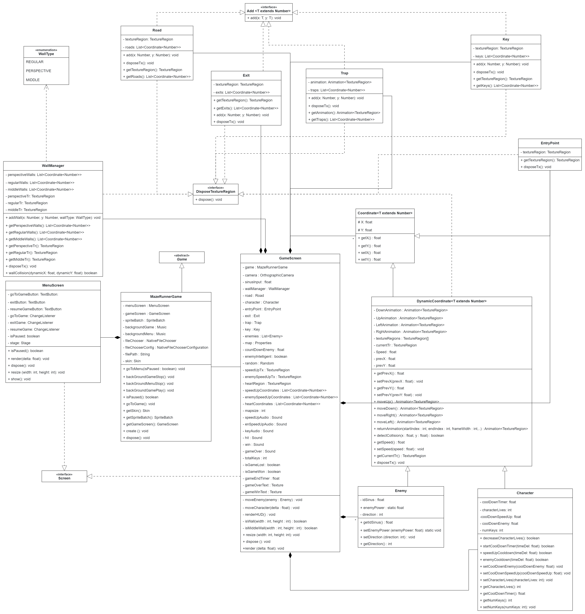

# MazeRunnerGame
***
***

## - Code Structure:
***
**NOTE** Both the class_hierarchy.png (shown below)and class_hierarchy.json 
(intractable file which can be opened on TUM Apollon) are also added in the main directory.




## - Opening the Game:
***
- Step1: Click on Run 'Run Game' button at the top-right hand corner of IntelliJ IDEA window to open the Game window. It opens the 'Maze Runner' game window.


- Step2: In the game window, click on 'Choose a file' button. A new 'Open' window appears. Search and then select the maze file(should be .properties) in the 'Open' Window and then click on the open button. This creates a maze using the selected maze file and starts the game. 

## - Running the Game:
***
### Game Main Menu:
- **'Resume' button:** Appears only when the game is paused (by pressing Esc during GamePlay). Click to go back to the game and continue playing.


- **'Choose a file' button:** Opens a new 'Open' Window where you can search for and select a maze file (.properties) to be loaded into the game.


- **'Exit' button:** Closes the game entirely.

### Main Character Controls:

- **NOTE:** The HUD displays the number of character lives left and key collection status. The key symbol
appears with a dark shade before the key has been collected by the player and turns colorful as soon as the player
collects the key.


- Press Left Arrow Key on the keyboard to move the character left.
- Press Right Arrow Key on the keyboard to move the character right.
- Press Up Arrow Key on the keyboard to move the character up.
- Press Down Arrow Key on the keyboard to move the character down.


- **IMPORTANT :**  During the gameplay, press Esc (Escape) button on keyboard to pause the game and go back to the main menu.


### Bonus Additions to the Game (Beyond the basic requirements):

**NOTE:** For 1-3, only one collectable of each type is loaded for smaller mazes where mapsize <25 (mapsize = max value of the first 
key in a keypair out of all key pairs in the maze file). Otherwise, 4 collectables of each type are loaded to the maze. 

1. **Collectable Lives:** Appear as hearts on the Walkable Paths (Roads) in the maze and increase the character lives by one when 
collected by the player by moving over them. Each heart can only be collected once and disappears after collection by the player.


2. **Character SpeedUps:** Appear as small yellow plants with flowers, on the Walkable Paths (Roads) in the maze and increases 
character moving speed by 75% when collected by the player by moving over them. The character moving speed is reset to default speed after
coolDownSpeedUp (Cool down timer for character speed up) reaches zero. Each character SpeedUp can only be collected once and disappears 
after collection by the player.

   
3. **Enemy SpeedUps:** Appear as castle towers with red flags, on the Walkable Paths (Roads) in the maze and increase the speed
of the moving enemies by 75% when stepped on by the player. The enemy moving speed is reset to default speed after coolDownEnemy 
(Cool down timer for enemy speed up) reaches zero. Each Enemy speedUp can only be activated once and disappears after being activated
by the player.


4. **Intelligent Enemies:** The Enemies change direction every 8 seconds .Half of the time, the enemies move towards the character
and other half of the time, they move in a random direction. For moving towards the character, we compare the character's position
relative to the enemy and set the enemy movement direction accordingly. Have a look at the outer else if part of the following code to better
understand the logic:
```
       // Every 8 second change the direction of enemies. Half of the time towards the character.
        if (countDownEnemy < 0) {
            // Generate a random number between 0 and 3, every 8 seconds for enemy direction.
            for (Enemy enemy : enemies) {
                enemy.setDirection(random.nextInt(4));
            }
            enemyIntelligent = false;
            countDownEnemy = 16;
        } 
        
        //Comparing character's position relative to the enemy and setting the enemy movement direction accordingly.
        else if (!enemyIntelligent && countDownEnemy < 8) {
            for (Enemy enemy : enemies) {                
                
                //First we take the difference between the x-coordinates of both character
                //and enemy (difX) and then take difference between their y-coordinates (difY). 
                float difX = character.getX() - enemy.getX();
                float difY = character.getY() - enemy.getY();
                
                //Next, we compare the absolute values of both difX and difY.
                if (Math.abs(difX) >= Math.abs(difY)) {
                    if (difX <= 0) {
                        enemy.setDirection(0); // enemy moves Left
                    } else {
                        enemy.setDirection(1); //enemy moves right
                    }
                } else {
                    if (difY <= 0) {
                        enemy.setDirection(3); //enemy moves down
                    } else {
                        enemy.setDirection(2);//enemy move up
                    }
                }
            }

            countDownEnemy = 8;
            enemyIntelligent = true;
        }
```


